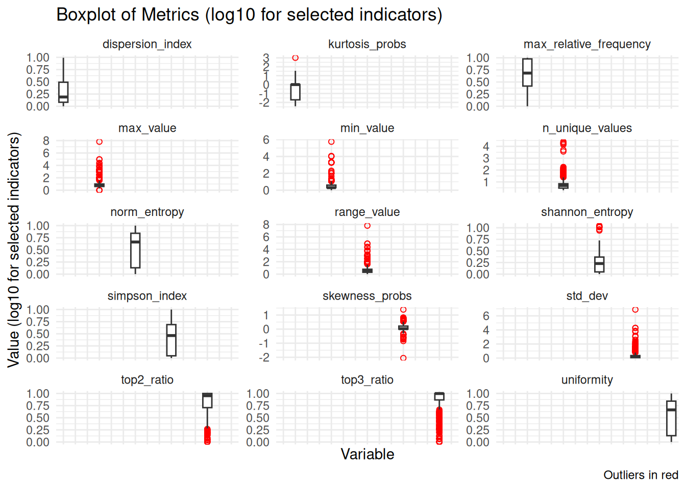
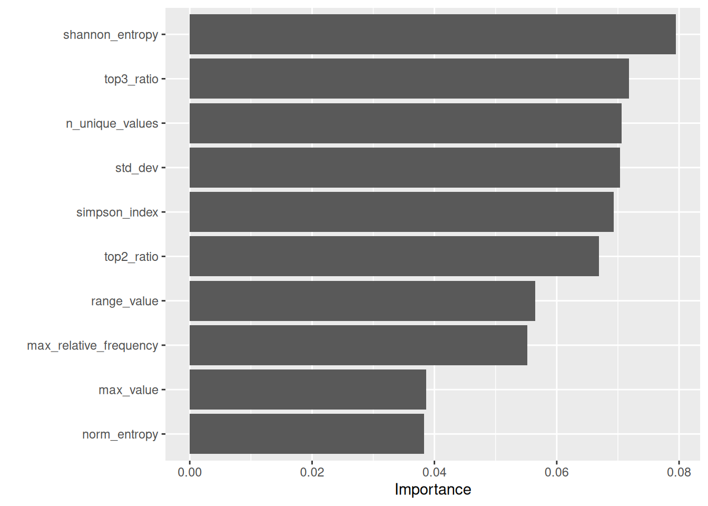
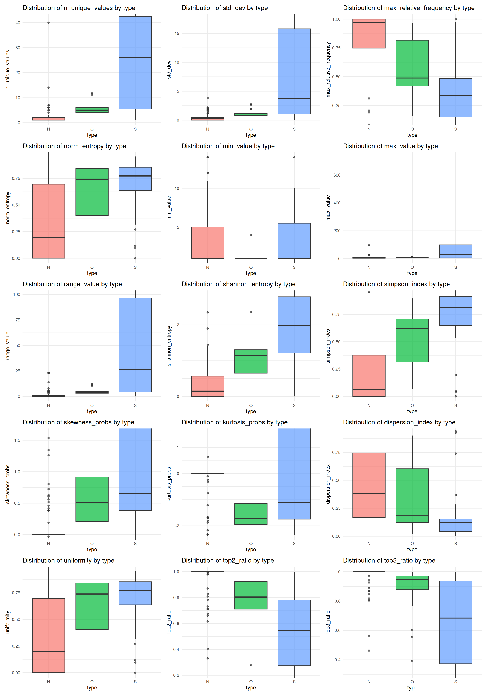

# Typerclass: Model Training and Evaluation Report

## Introduction

This document presents the model training and evaluation process carried
out using Typerclass. The goal is to provide a clear overview of the
methodological choices and results of the modeling process.

## Key decisions in the modeling process

The model was trained following a few important choices regarding the
data and the algorithm.

### Dataset composition

Data from three surveys available at the Italian Istitute of Statistics
(ISTAT) were combined:

- [Family, social subjects and life
  cycle](https://www.istat.it/en/microdata/multipurpose-survey-on-households-families-social-subjects-and-life-cycle-public-use-micro-stat-files/)
- [Labour Force
  Survey](https://www.istat.it/en/microdata/labour-force-survey-cross-sectional-quarterly-data-2/)
- [Aspects of daily
  life](https://www.istat.it/en/microdata/aspects-of-daily-life/)

The final dataset included 400 instances of class “Nominal”, 200 of
class “Ordinal”, and 125 of class “Scale” (mapped in the code as N, O,
and S, respectively).

## Indicators

The following indicators are used in the model, along with a brief
description of each:

- **n_unique_values** – Number of unique values in the variable
  (excluding missing values).  
- **std_dev** – Standard deviation; measures how spread out the values
  are.  
- **max_relative_frequency** – Proportion of the most frequent value
  relative to the total number of observations.  
- **norm_entropy** – Normalized entropy; measures how evenly the values
  are  
  distributed.
- **min_value** – Minimum observed value.  
- **max_value** – Maximum observed value.  
- **range_value** – Difference between the maximum and minimum values.
- **shannon_entropy** – Shannon entropy; a measure of uncertainty or
  information  
  content.
- **simpson_index** – Simpson diversity index; indicates how
  concentrated the values are.  
- **skewness_probs** – Skewness of the value-probability distribution;
  measures  
  asymmetry.
- **kurtosis_probs** – Excess kurtosis of the value distribution;
  indicates tail  
  heaviness.
- **dispersion_index** – Variance-to-mean ratio of value probabilities;
  measures  
  dispersion.
- **uniformity** – Shannon entropy normalized by `log(n_unique_values)`;
  measures distributional evenness.  
- **top2_ratio** – Sum of the probabilities of the two most frequent
  values.  
- **top3_ratio** – Sum of the probabilities of the three most frequent
  values.

The table provides an overview of all indicators used in the model. Most
indicators have no missing values, ensuring reliable inputs for
training. The only exception is `dispersion_index`, which contains 128
missing values. The `ranger` package can handle missing values by
default; preliminary tests also showed that imputation did not improve
model performance.

| Overview of Indicators and Missing Values |     |
|-------------------------------------------|-----|
| Indicator                                 | NAs |
| dispersion_index                          | 128 |
| n_unique_values                           | 0   |
| std_dev                                   | 0   |
| max_relative_frequency                    | 0   |
| norm_entropy                              | 0   |
| min_value                                 | 0   |
| max_value                                 | 0   |
| range_value                               | 0   |
| shannon_entropy                           | 0   |
| simpson_index                             | 0   |
| skewness_probs                            | 0   |
| kurtosis_probs                            | 0   |
| uniformity                                | 0   |
| top2_ratio                                | 0   |
| top3_ratio                                | 0   |

## Indicator Distributions

This section shows the distributions of all indicators, highlighting
variability and potential outliers. Several indicators display heavy
tails and numerous outliers, while others (e.g., proportion-based
measures) are more tightly concentrated; overall, the plots suggest
substantial heterogeneity across predictors.

To improve readability, a log transformation (log10 with +1) was applied
to a subset of indicators with very different scales or heavy tails. The
remaining panels are shown on the original scale so that comparably
scaled indicators can be interpreted directly.

## Correlation matrix

The correlation matrix displays pairwise relationships between all model
indicators. Several predictors show high correlations, but they were
retained in the dataset because Random Forest — one of the algorithms
selected for this study — is robust to multicollinearity. In fact,
including correlated indicators can still improve model performance by
providing additional predictive information.

| Correlation Matrix of Indicators |                 |         |                        |              |           |           |             |                 |               |                |                |                  |            |            |            |
|----------------------------------|-----------------|---------|------------------------|--------------|-----------|-----------|-------------|-----------------|---------------|----------------|----------------|------------------|------------|------------|------------|
| indicator                        | n_unique_values | std_dev | max_relative_frequency | norm_entropy | min_value | max_value | range_value | shannon_entropy | simpson_index | skewness_probs | kurtosis_probs | dispersion_index | uniformity | top2_ratio | top3_ratio |
| n_unique_values                  | 1.0             | 0.3     | −0.2                   | 0.1          | 0.3       | 0.3       | 0.3         | 0.7             | 0.2           | 0.3            | 0.3            | −0.1             | 0.1        | −0.3       | −0.4       |
| std_dev                          | 0.3             | 1.0     | −0.1                   | 0.1          | 1.0       | 1.0       | 1.0         | 0.3             | 0.1           | 0.8            | 1.0            | 0.0              | 0.1        | −0.1       | −0.2       |
| max_relative_frequency           | −0.2            | −0.1    | 1.0                    | −0.9         | −0.1      | −0.1      | −0.1        | −0.8            | −1.0          | −0.3           | −0.1           | 0.9              | −0.9       | 0.9        | 0.8        |
| norm_entropy                     | 0.1             | 0.1     | −0.9                   | 1.0          | 0.1       | 0.1       | 0.1         | 0.6             | 0.9           | 0.1            | 0.0            | −1.0             | 1.0        | −0.6       | −0.5       |
| min_value                        | 0.3             | 1.0     | −0.1                   | 0.1          | 1.0       | 1.0       | 1.0         | 0.3             | 0.1           | 0.8            | 1.0            | −0.1             | 0.1        | −0.1       | −0.2       |
| max_value                        | 0.3             | 1.0     | −0.1                   | 0.1          | 1.0       | 1.0       | 1.0         | 0.3             | 0.1           | 0.8            | 1.0            | 0.0              | 0.1        | −0.1       | −0.2       |
| range_value                      | 0.3             | 1.0     | −0.1                   | 0.1          | 1.0       | 1.0       | 1.0         | 0.3             | 0.1           | 0.8            | 1.0            | 0.0              | 0.1        | −0.1       | −0.2       |
| shannon_entropy                  | 0.7             | 0.3     | −0.8                   | 0.6          | 0.3       | 0.3       | 0.3         | 1.0             | 0.8           | 0.5            | 0.3            | −0.5             | 0.6        | −0.9       | −0.9       |
| simpson_index                    | 0.2             | 0.1     | −1.0                   | 0.9          | 0.1       | 0.1       | 0.1         | 0.8             | 1.0           | 0.3            | 0.1            | −0.9             | 0.9        | −0.8       | −0.7       |
| skewness_probs                   | 0.3             | 0.8     | −0.3                   | 0.1          | 0.8       | 0.8       | 0.8         | 0.5             | 0.3           | 1.0            | 0.8            | −0.1             | 0.1        | −0.4       | −0.4       |
| kurtosis_probs                   | 0.3             | 1.0     | −0.1                   | 0.0          | 1.0       | 1.0       | 1.0         | 0.3             | 0.1           | 0.8            | 1.0            | −0.1             | 0.0        | −0.2       | −0.2       |
| dispersion_index                 | −0.1            | 0.0     | 0.9                    | −1.0         | −0.1      | 0.0       | 0.0         | −0.5            | −0.9          | −0.1           | −0.1           | 1.0              | −1.0       | 0.6        | 0.5        |
| uniformity                       | 0.1             | 0.1     | −0.9                   | 1.0          | 0.1       | 0.1       | 0.1         | 0.6             | 0.9           | 0.1            | 0.0            | −1.0             | 1.0        | −0.6       | −0.5       |
| top2_ratio                       | −0.3            | −0.1    | 0.9                    | −0.6         | −0.1      | −0.1      | −0.1        | −0.9            | −0.8          | −0.4           | −0.2           | 0.6              | −0.6       | 1.0        | 1.0        |
| top3_ratio                       | −0.4            | −0.2    | 0.8                    | −0.5         | −0.2      | −0.2      | −0.2        | −0.9            | −0.7          | −0.4           | −0.2           | 0.5              | −0.5       | 1.0        | 1.0        |

## Model Selection

### Preprocessing Recipe

We tested a preprocessing approach using median imputation for all
numeric predictors. However, preliminary tests showed no improvement in
model performance, so we decided to proceed with a recipe without any
imputation.

Random Forest and XGBoost were both selected and evaluated with
hyperparameter tuning.

### Model Specification: Random Forest

### Hyperparameter Tuning for Random Forest

We selected the `mtry` range using the classic rule-of-thumb centered on
`sqrt(p)`, where `p` is the number of predictors, and expanded it by
±50% to allow slightly simpler or more complex splits.

| Best Random Forest Hyperparameters |        |       |                  |
|------------------------------------|--------|-------|------------------|
| mtry                               | trees  | min_n | .config          |
| 2.00                               | 410.00 | 4.00  | pre0_mod06_post0 |

### Model Specification: XGBoost

XGBoost was specified using a gradient-boosted tree model with tunable
hyperparameters. We used the `xgboost` engine and set the model to
classification mode to predict the three classes.

### Hyperparameter Tuning for XGBoost

We tuned XGBoost using the same cross-validation folds as Random Forest.
The `mtry` range follows the same rule-of-thumb (centered on `sqrt(p)`),
while the other hyperparameters use typical ranges for boosted trees.

| Best XGBoost Hyperparameters |         |       |            |            |                |             |                  |
|------------------------------|---------|-------|------------|------------|----------------|-------------|------------------|
| mtry                         | trees   | min_n | tree_depth | learn_rate | loss_reduction | sample_size | .config          |
| 3.000                        | 889.000 | 2.000 | 6.000      | 1.674      | 3.360          | 0.921       | pre0_mod12_post0 |

## Evaluation

### Confusion matrix

We compare Random Forest and XGBoost on the same held-out test set. The
confusion matrices are normalized by row (true class), so values
represent per-class recall.

| Summary of Confusion Matrix (Per-Class Recall, %) |                 |                 |                 |                 |                 |                 |                 |                 |                 |
|---------------------------------------------------|-----------------|-----------------|-----------------|-----------------|-----------------|-----------------|-----------------|-----------------|-----------------|
| Model                                             | True N → Pred N | True N → Pred O | True N → Pred S | True O → Pred N | True O → Pred O | True O → Pred S | True S → Pred N | True S → Pred O | True S → Pred S |
| RF_tuned                                          | 91.1            | 15.6            | 4.3             | 5.1             | 73.3            | 13.0            | 3.8             | 11.1            | 82.60870        |
| XGB_tuned                                         | 87.8            | 14.3            | 8.7             | 7.3             | 71.4            | 17.4            | 4.9             | 14.3            | 73.91304        |

### Performance metrics

The table below compares Random Forest and XGBoost on the same test set
using a consistent set of metrics (accuracy, balanced accuracy, macro
F1, Cohen’s Kappa, and macro ROC AUC). Hyperparameters were selected
using accuracy for simplicity; we report additional metrics to assess
class‑balanced performance.

| Model Comparison Metrics |          |              |          |          |          |
|--------------------------|----------|--------------|----------|----------|----------|
| model                    | accuracy | bal_accuracy | f_meas   | kap      | roc_auc  |
| RF_tuned                 | 0.84     | 0.86         | 0.81     | 0.74     | 0.93     |
| XGB_tuned                | 0.81     | 0.83         | 0.77     | 0.68     | 0.90     |
| Winner                   | RF_tuned | RF_tuned     | RF_tuned | RF_tuned | RF_tuned |

Accuracy is the overall proportion of correct predictions, while
balanced accuracy averages recall across classes to reduce
class-imbalance effects. Macro F1 gives equal weight to each class,
Cohen’s Kappa adjusts for chance agreement, and macro ROC AUC summarizes
discriminative ability across classes. Based on the average of these
metrics, the best overall model is **RF_tuned**.

### Misclassification Analysis

Misclassifications are inspected on the held-out test set to avoid
optimistic bias. The tables below summarize the misclassification
patterns for each model.

| Misclassification Summary (Test Set) — RF |                 |       |     |
|:------------------------------------------|:----------------|:------|:----|
| True class                                | Predicted class | Count |     |
| N                                         | O               | 7     |     |
| N                                         | S               | 1     |     |
| O                                         | N               | 4     |     |
| O                                         | S               | 3     |     |
| S                                         | N               | 3     |     |
| S                                         | O               | 5     |     |

| Misclassification Summary (Test Set) — XGBoost |                 |       |
|:-----------------------------------------------|:----------------|:------|
| True class                                     | Predicted class | Count |
| N                                              | O               | 6     |
| N                                              | S               | 2     |
| O                                              | N               | 6     |
| O                                              | S               | 4     |
| S                                              | N               | 4     |
| S                                              | O               | 6     |

For RF, the most frequent error is N → O (7 cases, 23 total
misclassifications). For XGBoost, the top confusion is N → O (6 cases,
28 total). These summaries highlight whether errors cluster between
adjacent classes or are more diffuse; fewer and more concentrated errors
generally indicate a more reliable model.

**Consistent with the overall performance metrics, Random Forest remains
the best-performing model and will be used for the final classifier.**

### Variable importance scores

This plot reports permutation importance for the Random Forest model.
For each indicator, its values are randomly permuted and the resulting
drop in model performance is measured; larger drops indicate more
important predictors. Because several indicators are correlated (as
shown in the correlation section), importance can be shared across
related features, so the plot should be read as a relative ranking
rather than an absolute measure of effect.

### Distribution of Predictor Variables by True Class (N, O, S)

The final figure shows the distribution of predictor variables by their
true class (N, O, S) on the test set, highlighting how indicator values
vary across classes.

